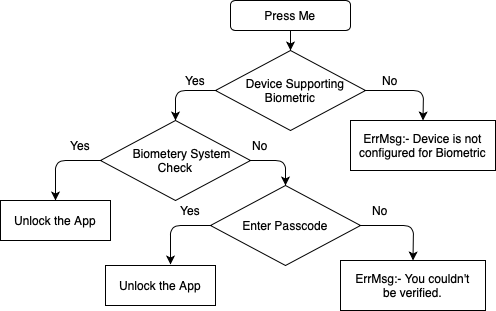
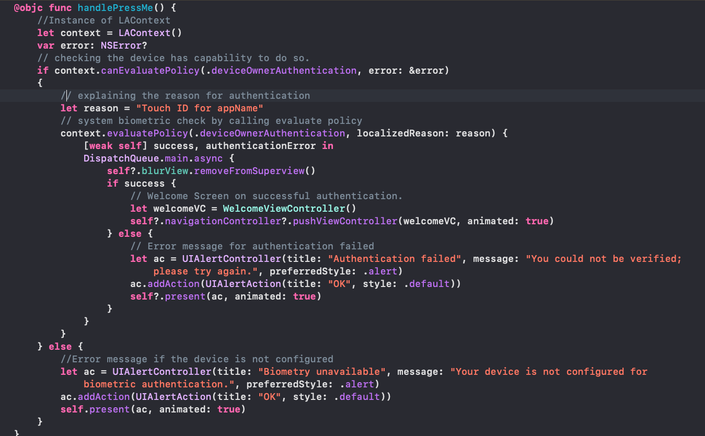

# Touch ID, Face ID and Local Authentication

Touch ID and Face ID let users to access the app, in a much easier way. To access the Touch ID and Face ID feature, we need to import LocalAuthentication framework.

### Before attempting to authenticate, we should perform the below points :-

- Import the LocalAuthentication and create an instance of LAContext.
 LAContext :- A mechanism for evaluating authentication policies and access controls.
 

- Check whether the device is capable of supporting authentication and is confirgured by users in the app settings by calling the method canEvaluatePolicy(_:error:).
 

> The policy controls how the authentication behaves. For example, the LAPolicy.deviceOwnerAuthentication policy used in this sample indicates that reverting to a passcode is allowed when biometrics fails or is unavailable. Alternatively, you can indicate the LAPolicy.deviceOwnerAuthenticationWithBiometrics policy, which doesn't allow reverting to the device passcode.

-  If the , the system biometric check will begin - explaining the reason why the system is asking for authentication. 
    For Touch ID, the reason is written in code and for Face ID its mentioned in info.plist.
    
    
-  After the successful authentication, unlock the app.

### Flow Chart for better understanding.

 

### Now let see the code:- 
HandlePressMe() will handle the code for biometric authentication. This function will be called on the click of Press Me button.
 

### Demo 

### Reference Link
- [Logging a User into Your App with Face ID or Touch ID](https://developer.apple.com/documentation/localauthentication/logging_a_user_into_your_app_with_face_id_or_touch_id)
- [Touch to activate: Touch ID, Face ID and LocalAuthentication](https://www.hackingwithswift.com/read/28/4/touch-to-activate-touch-id-face-id-and-localauthentication)

